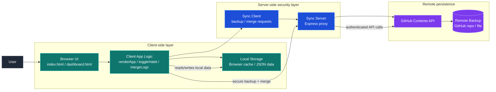

# Architecture Overview

This project follows a lightweight client-first architecture with a secure sync layer and GitHub-backed persistence.

## Components

- Browser UI: renders habits, schedules, and activity state.
- Client App Logic: handles local state, rendering, toggling, and merge logic.
- Local Storage: stores the working data locally in the browser.
- Sync Server: acts as a trusted intermediary that avoids exposing credentials on the client.
- GitHub Contents API: stores backup snapshots and versioned updates remotely.
- Remote Backup: final persisted state for sync and recovery.

## Data flow

1. The user interacts with the browser UI.
2. Client logic updates local storage and refreshes the rendered view.
3. When a sync is triggered, the client sends a backup/merge request to the server.
4. The server performs GitHub API calls on behalf of the user using stored secrets.
5. The remote repository receives the updated backup state.

## Design intent

- Keep the frontend simple and fast.
- Avoid storing personal access tokens in the browser.
- Centralize GitHub access in a backend proxy for better security.
- Support sync, merge, and recovery with remote backups.
